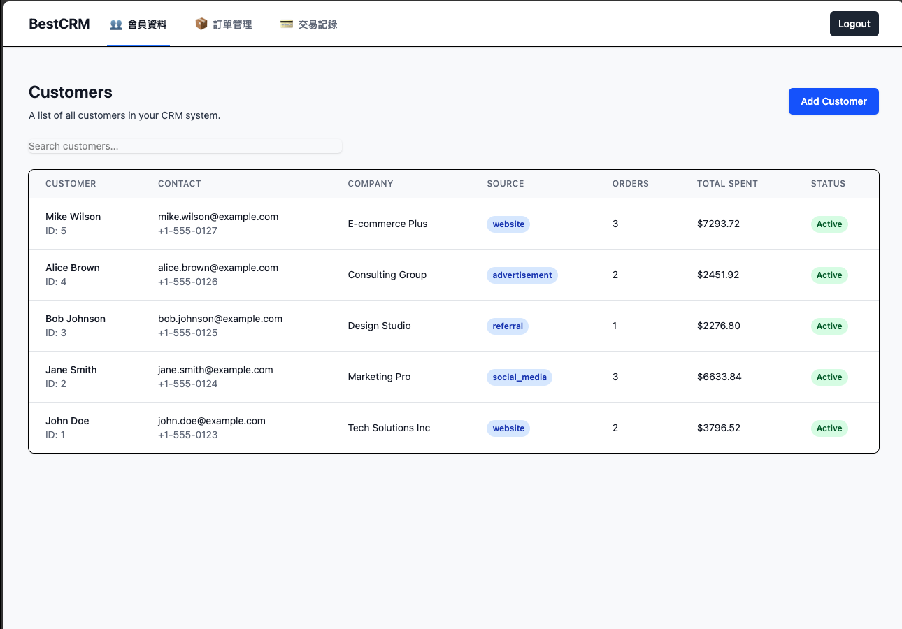
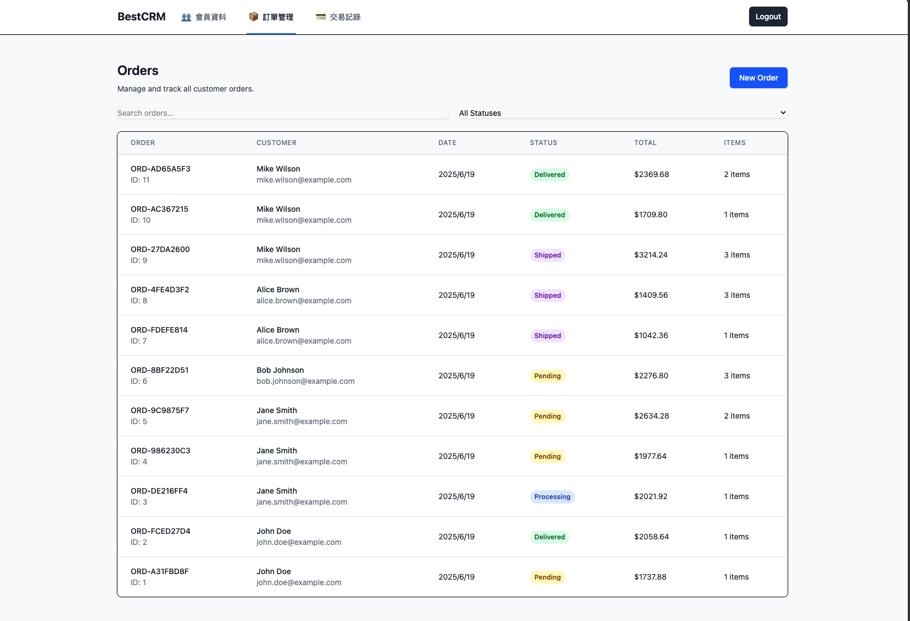
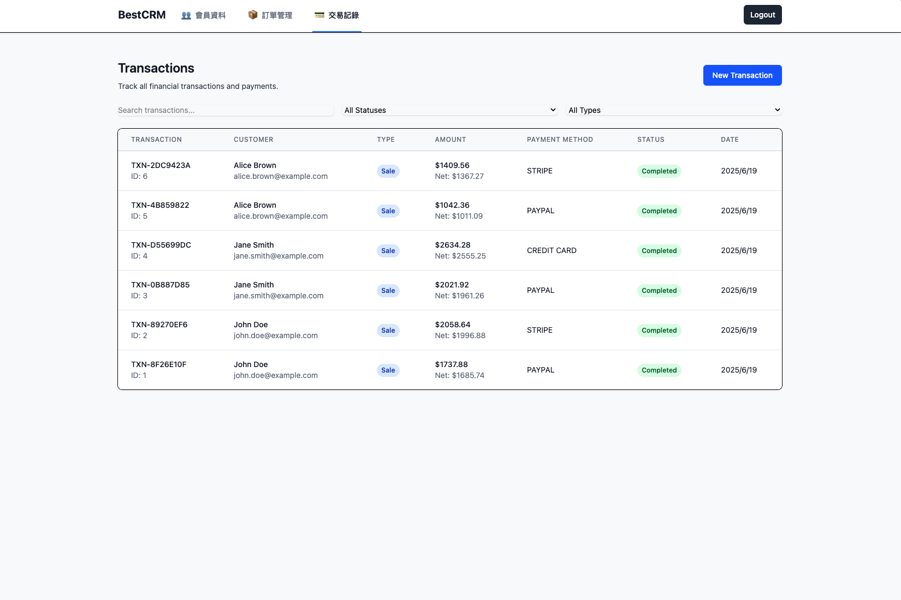
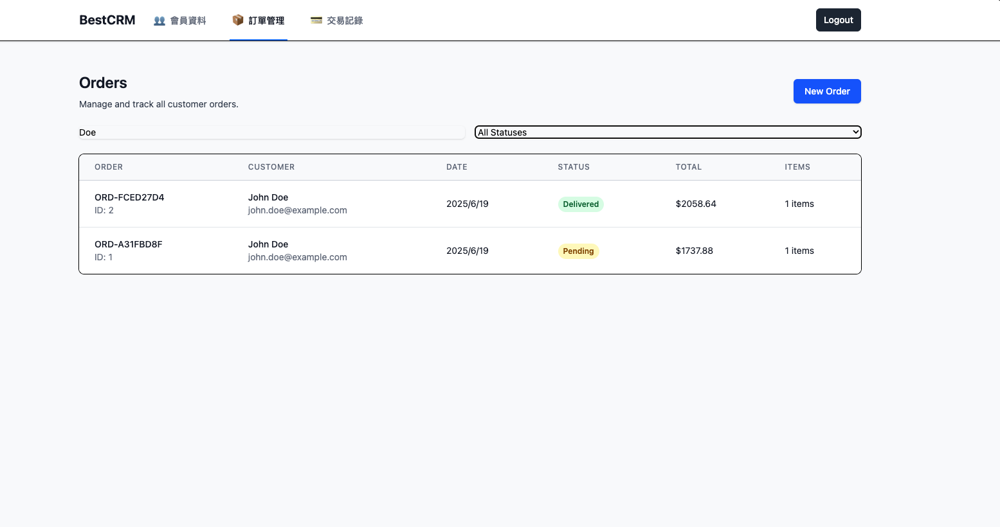
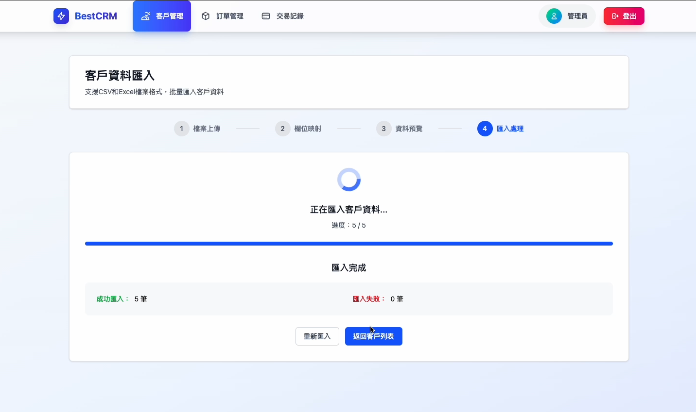

# MiniCRM Pro - 輕量型智慧全端 AI CRM 系統

<div align="center">


</div>

---

## 專案概述

MiniCRM Pro 是一個為輕量化的專為中小型企業與業務團隊設計的高效率 CRM 系統。採用 Django REST API 後端與 React + TS 前端，具備靈活的資料管理、即時查詢、視覺化報表與 AI 智慧摘要，協助你用最輕量的方式打造最智慧的客戶經營流程，提供管理客戶關係、追蹤銷售業績以及分析業務表現所需的一切工具。

目前有三個主要功能模組：

- customers (客戶管理)
- orders (訂單管理)
- transactions (交易記錄)

## 核心功能及特色

### 現代化技術架構

- 使用 React + TypeScript + TailwindCSS 開發，界面清晰，操作流暢
- RWD，支援桌機與行動裝置使用
- 模組化架構設計，方便後續功能擴充與客製化

### 客戶資料彈性匯入

- 支援手動新增或批次匯入（CSV / Excel）
- 多欄位對應設計，可選擇忽略不必要欄位
- 匯入支援欄位對應與容錯，不完整資料亦可導入

### 進階搜尋與即時篩選

- 多條件篩選與即時模糊搜尋功能
- 可跨欄位比對，快速定位目標客戶或交易紀錄
- 操作直覺，適合大量資料環境

### 即時報表生成 - 尚未開發

- 一鍵產出關鍵指標圖表（客戶數、成交金額、轉換率等）
- 可依區間、來源、標籤等條件切換統計維度
- 清晰呈現營運概況與銷售表現

### AI 應用擴充性 - 尚未開發

- 系統預留 AI 模組接口，支援導入：
  - 客戶價值分析與自動分群
  - 聯絡紀錄摘要與後續建議
  - 流失預警、銷售機會預測
  - 自動標籤推薦與話術輔助生成

---

## 系統頁面截圖

### 登入頁面


### 會員資料管理




### 訂單管理




### 交易記錄




### 搜尋與篩選資料



### 匯入客戶資料



---

## 🛠️ Tech Stack

### 後端

- **框架**: Django 4.2.7 + Django REST Framework
- **身份驗證**: JWT (Simple JWT)
- **資料庫**: MySQL (可配置)
- **API 文件**: DRF 自動產生
- **安全性**: CORS 標頭、環境變數配置

### 前端

- **框架**: React 19 with TS
- **樣式設計**: TailwindCSS 4
- **路由管理**: React Router 6
- **HTTP 客戶端**: Axios with interceptors
- **建置工具**: Vite
- **狀態管理**: React Hooks

### 開發工具

- **環境管理**: Python venv
- **套件管理**: pip (Python), npm (Node.js)
- **程式碼品質**: ESLint, TypeScript
- **版本控制**: Git 與 .gitignore

---

## 🚀 快速開始

### 系統需求

- **Python** 3.8+
- **Node.js** 16+
- **MySQL** 5.7+ (或 SQLite 作為替代)
- **Git**

### 1. 複製專案與設定

```bash
# 複製儲存庫
git clone https://github.com/yourusername/react-ts-crm.git
cd react-ts-crm

# 設定環境變數
cp .env.example .env
# 編輯 .env 檔案，填入您的資料庫設定
```

### 2. 後端設定

```bash
# 建立並啟動虛擬環境
python -m venv venv
source venv/bin/activate  # Windows: venv\Scripts\activate

# 安裝相依套件
pip install -r requirements.txt

# 執行資料庫遷移
python manage.py migrate

# 建立超級使用者
python manage.py createsuperuser

# 建立範例資料 (選用)
python simple_dummy_data.py

# 啟動 Django 伺服器
python manage.py runserver
```

### 3. 前端設定

```bash
# 進入前端目錄
cd frontend

# 安裝相依套件
npm install

# 啟動開發伺服器
npm run dev
```

### 4. 存取應用程式

- **前端介面**: http://localhost:5173
- **後端 API**: http://localhost:8000
- **管理後台**: http://localhost:8000/admin
- **示範登入**: `www` / `young0921`

---

## 🎯 功能特色

### 👥 會員資料管理

- **完整客戶檔案** - 姓名、聯絡資訊、公司詳情、地址資料
- **來源追蹤** - 監控客戶獲取管道
- **標籤系統** - 靈活的自訂標籤分類
- **活動歷史** - 完整的客戶互動稽核軌跡
- **智慧搜尋** - 即時搜尋任何欄位資料

### 📦 訂單管理

- **訂單生命週期** - 從建立到交付的完整追蹤
- **多項目訂單** - 支援複雜的多商品訂單
- **狀態管理** - 待處理、處理中、已出貨、已送達、已取消
- **財務計算** - 自動計算稅額、運費和折扣
- **地址管理** - 分離的帳單與送貨地址

### 💳 交易記錄追蹤

- **付款方式** - 支援信用卡、PayPal、Stripe、銀行轉帳
- **交易類型** - 銷售、退款、付款、退單
- **手續費計算** - 自動計算付款處理手續費
- **閘道整合** - 為付款閘道整合做好準備
- **財務報表** - 完整的交易歷史與分析

---

## 📖 API 文件

### 身份驗證端點

```
POST /api/auth/login/          # 使用帳號密碼登入
POST /api/auth/refresh/        # 刷新 JWT 令牌
```

### 客戶管理端點

```
GET    /api/customers/         # 列出客戶 (含分頁)
POST   /api/customers/         # 建立新客戶
GET    /api/customers/{id}/    # 取得客戶詳情
PUT    /api/customers/{id}/    # 更新客戶資料
DELETE /api/customers/{id}/    # 刪除客戶
GET    /api/customers/{id}/orders/       # 取得客戶訂單
GET    /api/customers/{id}/transactions/ # 取得客戶交易記錄
```

### 訂單管理端點

```
GET    /api/orders/            # 列出訂單 (含分頁)
POST   /api/orders/            # 建立新訂單
GET    /api/orders/{id}/       # 取得訂單詳情
PUT    /api/orders/{id}/       # 更新訂單
DELETE /api/orders/{id}/       # 刪除訂單
```

### 交易記錄端點

```
GET    /api/transactions/      # 列出交易記錄 (含分頁)
POST   /api/transactions/      # 建立新交易記錄
GET    /api/transactions/{id}/ # 取得交易詳情
PUT    /api/transactions/{id}/ # 更新交易記錄
DELETE /api/transactions/{id}/ # 刪除交易記錄
```

### 查詢參數

所有列表端點都支援：

- **search**: `?search=關鍵字` - 跨相關欄位搜尋
- **filtering**: `?status=active&source=website` - 依欄位值篩選
- **ordering**: `?ordering=-created_at` - 排序結果
- **pagination**: `?page=2&page_size=20` - 分頁處理

---

## ⚙️ 環境設定

### 環境變數

在根目錄建立 `.env` 檔案：

```bash
# Django 設定
DEBUG=True
SECRET_KEY=your-secret-key-here

# 資料庫設定 (MySQL)
DB_ENGINE=django.db.backends.mysql
DB_NAME=crm_dashboard
DB_USER=your_db_user
DB_PASSWORD=your_db_password
DB_HOST=your_db_host
DB_PORT=3306

# SQLite 替代方案
# DB_ENGINE=django.db.backends.sqlite3
# DB_NAME=db.sqlite3
```

### 前端設定

前端會自動連接到 Django API。如需更改 API 基礎網址，請更新 `src/services/api.ts`。

---

## 🚀 部署

### 正式環境設定

1. **環境變數**: 在正式環境中設定 `DEBUG=False`
2. **資料庫**: 正式環境建議使用 PostgreSQL 或 MySQL
3. **靜態檔案**: 設定適當的靜態檔案服務
4. **安全性**: 更新 `ALLOWED_HOSTS` 及其他安全設定
5. **HTTPS**: 啟用 SSL/TLS 安全通訊

### Docker 支援 (即將推出)

```bash
# 使用 Docker Compose 建置並執行
docker-compose up --build
```

---

## 🧪 測試

### 後端測試

```bash
# 執行 Django 測試
python manage.py test

# 執行覆蓋率測試
coverage run manage.py test
coverage report
```

### 前端測試

```bash
# 執行 React 測試
cd frontend
npm test

# 執行覆蓋率測試
npm run test:coverage
```

---

## 📊 資料庫架構

### 核心模型

- **Customer**: 個人資訊、聯絡詳情、來源追蹤
- **Order**: 訂單管理，包含項目與財務計算
- **OrderItem**: 訂單內的個別商品
- **Transaction**: 付款追蹤與財務記錄

### 關聯關係

- Customer → Orders (一對多)
- Customer → Transactions (一對多)
- Order → OrderItems (一對多)
- Order → Transactions (一對多)

---

<div align="center">

**⭐ Star this repository if you find it helpful!**

Made with ❤️ by [Young](https://github.com/youngOman)

</div>
