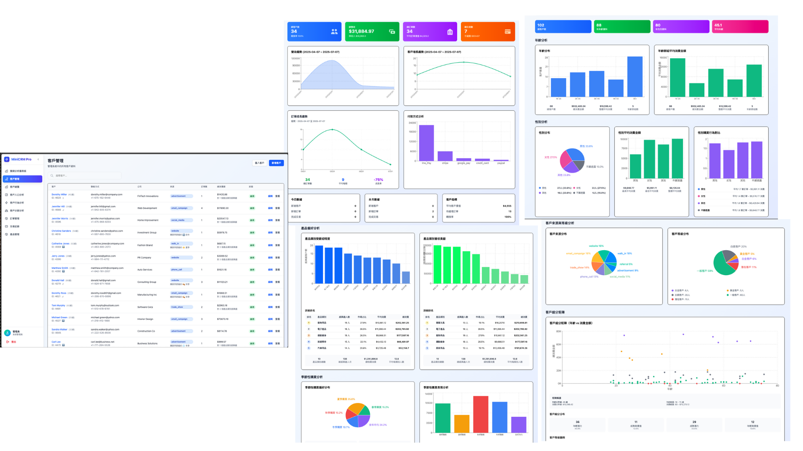
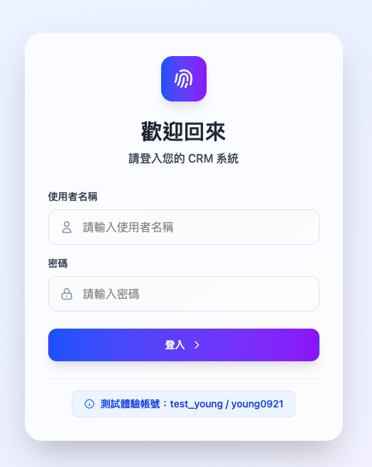
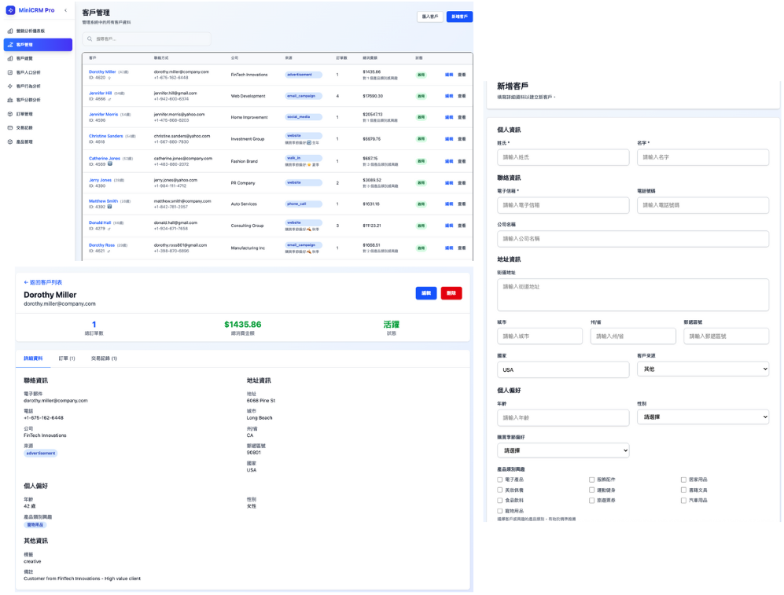
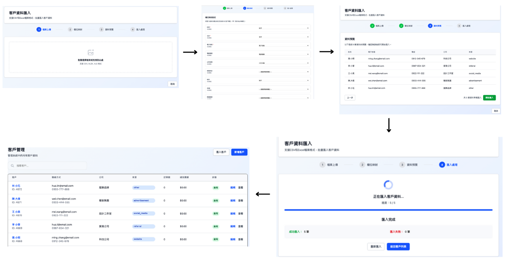
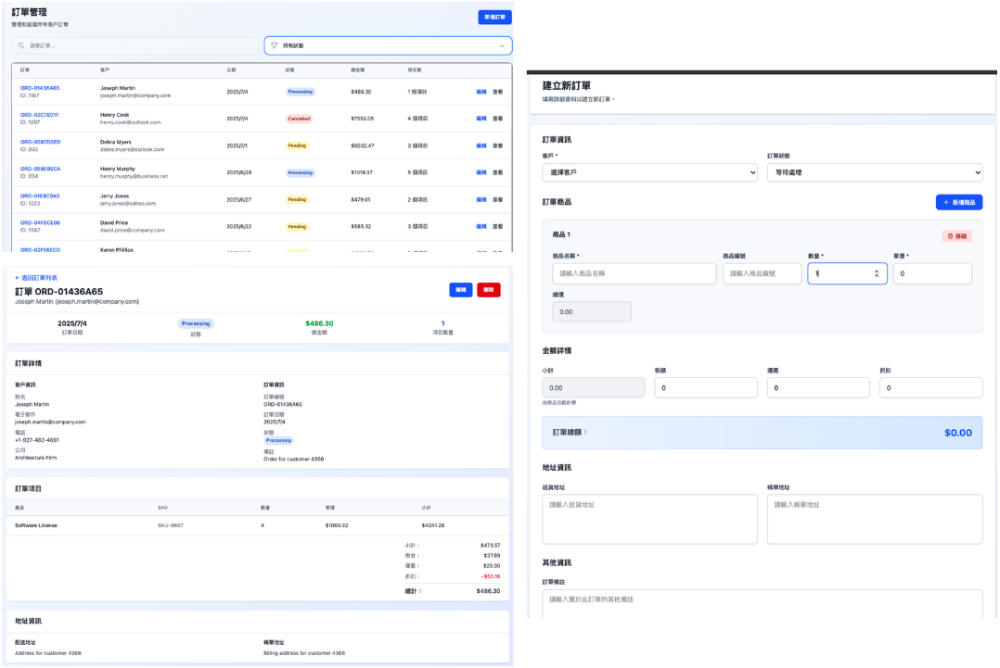
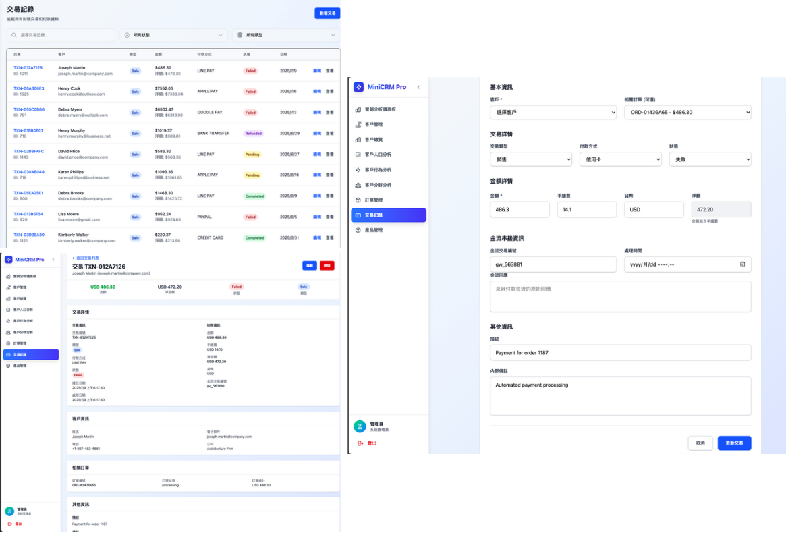
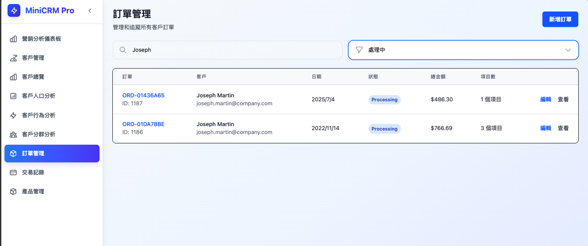
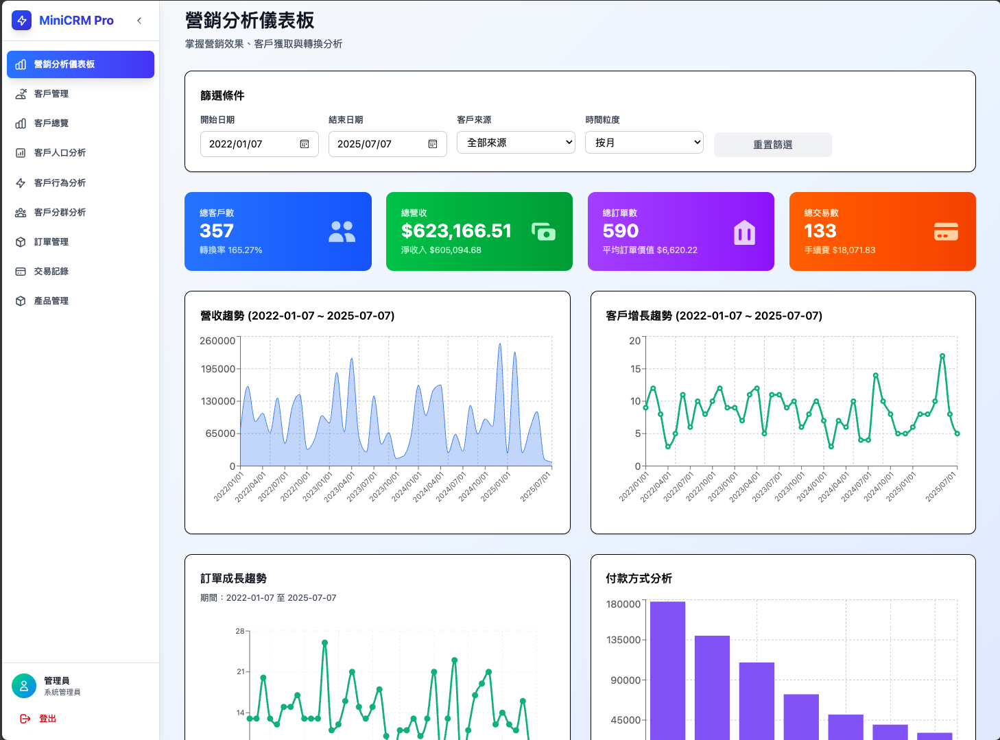

# MiniCRM Pro - 輕量型、一站式 B2C CRM 系統

<div align="center">
  
  <br/>
  
  
  
  
</div>

---

## 專案概述

MiniCRM Pro 是一套輕量型、免費開源的高效率 CRM 系統，專為中小企業、創業者與小型電商打造，不需設定、免授權費、免繁瑣導入流程，只保留最實用的 CRM 核心功能。

1. 整合聯絡資訊、互動紀錄、購買歷史、服務請求、資產紀錄與報價／促銷紀錄，建立完整可追溯的客戶輪廓，掌握每位客戶的偏好、行為、問題、需求、價值
   1. 同時管理多個品牌與供應商，不同品牌或供應商可進行獨立的客戶資料管理(訂單、交易記錄..等)
2. 管理客戶關係、追蹤銷售業績及分析業務表現，並進行後續的精準再行銷及提升顧客忠誠度及回流率。
   1. 瞭解公司是否朝正確方向邁進，或是否有不足之處。
   2. 獲得更多潛在客戶、提升生產力，以及提升客戶滿意度
3. 視覺化儀表板與報表如
   1. 營收趨勢、今日、本月(新增客戶量、新增訂單、完成交易數)、客戶指標(平均客戶價值、待處理訂單、轉換率)...等
   2. 客戶增長趨勢、客戶來源分佈、客戶價值分析、客戶行為分析...
   3. 客戶生命週期價值 (CLV) 計算及分析： 客戶價值分布、各客戶來源價值、頂級客戶排行、月度 CLV 趨勢...
4. (開發中)：成交率、追加銷售率、新淨收入、銷售週期長短、客戶獲取成本 (CAC)、 AI 智慧摘要

## 核心功能模組

### 1. 營銷分析儀表板

- **營收趨勢圖表**：顯示營收增長曲線與趨勢分析
- **客戶成長趨勢**：顯示客戶數量增長曲線與趨勢分析
- **訂單成長分析**：訂單數量與金額成長統計
- **交易分析**：付款方式分布、交易狀態統計、營收來源
- **關鍵指標卡片**：
  - 今日數據：新增客戶數、新增訂單數、完成交易數
  - 月度統計：客戶指標、平均客戶價值
  - 營運指標：待處理訂單、轉換率計算

### 2.客戶管理及分析頁面報表

- **客戶總覽**：客戶基本統計與導航中心、6 大關鍵指標、導航卡片、統一篩選器
  - 客戶基本資料 (姓名、聯絡方式、公司)
  - 客戶分類 (來源、標籤、備註)
  - 人口統計資料 (年齡、性別、購買偏好)
  - 客戶資料匯入功能
  - 客戶搜尋和排序
- **客戶人口分析**：年齡/性別分布、消費行為深度分析
- **客戶行為分析**：產品偏好、季節性購買模式分析、策略建議
- **客戶分群分析**：客戶來源效果、等級分布、細分矩陣
- **客戶終身價值(CLV)分析**：每個客戶在整個生命週期內預期能為公司帶來的總價值
  - CLV 概覽統計：平均 CLV、平均客單價、平均消費頻率、總客戶價值、平均顧客壽命
  - 客戶價值分布：低/中/高/頂級客戶分群分析
  - 來源 CLV 分析：各獲客渠道的客戶價值
  - 頂級客戶排行：CLV 前 20 名客戶詳細列表
  - 月度 CLV 趨勢：時間序列價值變化分析
  - 可以：
    - 關注最有價值的客戶群體
    - 追蹤不同獲客渠道的客戶價值
    - 制定基於 CLV 的精準行銷策略，比如針對高 CLV 值的客戶提供專屬優惠或服務
    - 監控客戶價值趨勢變化
- **批次資料匯入**：
  - 支援 CSV / Excel 檔案格式
  - 彈性欄位對應，可選擇忽略不必要欄位
  - 不完整資料亦可導入，具備容錯機制

_所有分析頁面皆支援篩選功能：日期範圍、客戶來源、年齡、性別_

### 3. 訂單管理系統

- **快速搜尋**：依訂單編號、客戶名稱、聯絡方式進行搜尋
- **狀態篩選**：待處理、處理中、已出貨、已送達、已取消、已退款
- **訂單詳情**：訂單資訊與項目管理(OrderItem)、金額計算 (小計、稅金、運費、折扣)
- **批次操作**：支援多筆訂單狀態更新
- 訂單建立、編輯、檢視、刪除

### 4. 產品管理系統

- **產品基本資料**：
  - 產品分類、品牌管理、供應商資料
  - SKU 編碼、SKU、價格少設定、成本、重量、尺寸、圖片
- **庫存追蹤**：
  - 現有/預留/可用庫存計算、異動記錄追蹤
  - 低庫存警示、缺貨提醒系統
  - 入庫、出庫、調整、盤點完整記錄
  - 多倉庫位置管理
  - 完整價格變動記錄與趨勢分析
- **價格管理**：歷史價格追蹤、變動記錄
- **變體支援**：產品規格管理（顏色、尺寸等）

### 5. 交易記錄管理

- **快速搜尋**：依交易編號、客戶名稱進行查找
- **多重篩選**：
  - 交易狀態：待處理、已完成、失敗、已取消、已退款
  - 交易類型：銷售、退款、付款、退單
- **付款方式**：多種付款方式統計(信用卡、PayPal、Stripe、銀行轉帳、現金、支票..等)
- **交易報表**：財務流水與分析

### 6. 客服記錄系統

- **客服工單管理**：
  - 可從客戶列表內選擇客戶或新增新客戶
  - 客服工單號碼自動生成邏輯：CS + 年月日 + 4 位序號
  - 工單狀態：開啟中、處理中、等待回應、已解決、已關閉
  - 優先級分類：低、中、高、緊急
  - 問題分類：一般諮詢、技術問題、計費問題、產品問題、物流問題、退換貨、客訴、功能建議
  - 工單內容：標題、問題描述、標籤
  - 負責人：專員 A、專員 B、專員 C...主管

- **客服記錄追蹤**：

可直接在工單詳情頁面查看工單基本資訊、狀態資訊、客服紀錄、時間軸

  - 客服互動歷史記錄
  - 內部備註、客戶回應、系統記錄、解決方案分類
  - 回應時間統計：首次回應時間、解決時間計算
  - 滿意度評分：1-5 分客戶滿意度評價

- **知識庫管理**：

  - 知識文章管理：FAQ、操作指南、政策說明、故障排除、SOP
  - 多層次分類結構：支援階層式分類管理
  - 內容統計：瀏覽次數、有用評價、無用評價追蹤
  - 精選文章：重要內容置頂顯示
  - 全文搜尋：標題、內容、標籤快速檢索

- **FAQ 常見問題**：

  - 問答管理：問題與答案配對維護
  - 分類整理：依業務類型分門別類
  - 置頂功能：重要問題優先顯示
  - 使用統計：追蹤查看次數分析

- **客服統計分析**：
  - 工單統計：按狀態、優先級、分類統計
  - 績效分析：處理工單數量、回應速度統計
  - 知識庫使用分析：熱門文章、搜尋關鍵字統計

## 核心功能

### 進階搜尋與即時篩選

- 多條件篩選與即時模糊搜尋功能
- 可跨欄位比對，快速定位目標客戶或交易紀錄

- 新增快速搜尋篩選功能
  - 客戶管理，可依 客戶名稱、聯絡方式(Email、電話)、公司、來源 進行搜尋
  - 訂單管理，可依 訂單編號、客戶名稱、聯絡方式、訂、狀態 進行搜尋
    - 下拉選單可依
      - 訂單狀態(待處理、處理中、已出貨、已送達、已取消、已退款)篩選
  - 交易記錄，可依 交易編號、客戶名稱搜尋
    - 下拉選單可依
      - 交易狀態(待處理、已完成、失敗、已取消、已退款)篩選，
      - 類型（銷售、退款、付款、退單）篩選

### 即時報表生成

- 一鍵生成關鍵指標圖表（客戶數、成交金額、轉換率等）
- 可依區間、來源、標籤等條件切換統計維度
- 清晰呈現營運概況與銷售表現

---

## 系統頁面截圖

### 登入頁面



### 客戶資料管理

- 可手動新增、編輯客戶資料，可編輯 姓名、Email、電話、地址、公司、年齡、性別、購買季節偏好、購買產品類別偏好、備註...等欄位
- 也可直接在該客戶詳情頁面直接查詢：該客戶的歷史訂單與交易記錄、總消費金額、活躍度..等



### 匯入多筆客戶資料流程

- 支援手動新增或批次匯入（CSV / Excel）
- 多欄位對應設計，可選擇忽略不必要欄位
- 匯入具容錯能力，即使缺少總消費額、年齡、地址..等欄位也可成功導入，可後續補齊資料，預設顯示「未提供」



### 訂單管理

可手動新增訂單，也可直接在該訂單內連結到擁有此訂單的客戶，也可新增多項產品，並即時計算稅額、運費、折扣、總金額



### 交易記錄

- 可依照 交易狀態、交易類型 下拉選單快速篩選交易記錄，並可直接在該交易記錄內連結到該筆訂單
- 可手動新增交易記錄，編輯 交易類型、付款方式、付款狀態、金流串接資訊、金流回應、處理時間



### 搜尋與篩選資料

- 客戶管理系統

<!--  -->

- 訂單管理系統：搜尋 Joseph 開頭，訂單狀態為處理中的搜尋結果



### 營銷分析儀表板



### 客戶分析儀表板

#### 客戶總覽頁面

<!--  -->

#### 客戶人口分析

<!--  -->

#### 客戶行為分析

<!--  -->

#### 客戶分群分析

<!--  -->

### 產品管理系統

<!--  -->

---

## 🛠️ Tech Stack

### 後端

- **框架**: Django 4.2.7 + Django REST Framework
- **身份驗證**: JWT (Simple JWT)
- **資料庫**: MySQL (可配置)
- **API 文件**: DRF 自動產生
- **安全性**: CORS 標頭、環境變數配置

### 前端

- **框架**: React 19 with TS
- **樣式設計**: TailwindCSS 4
- **路由管理**: React Router 6
- **HTTP 客戶端**: Axios with interceptors
- **建置工具**: Vite
- **狀態管理**: React Hooks

### 開發工具

- **環境管理**: Python venv
- **套件管理**: pip (Python), npm (Node.js)
- **程式碼品質**: ESLint, TypeScript
- **版本控制**: Git 與 .gitignore

---

## 快速開始

### 系統需求

- **Python** 3.8+
- **Node.js** 16+
- **MySQL** 5.7+ (或 SQLite 作為替代)
- **Git**

### 1. 複製專案與設定

```bash
# 複製儲存庫
git clone https://github.com/yourusername/react-ts-crm.git
cd react-ts-crm

# 設定環境變數
cp .env.example .env
# 編輯 .env 檔案，填入您的資料庫設定
```

### 2. 後端設定

```bash
# 建立並啟動虛擬環境
python -m venv venv
source venv/bin/activate  # Windows: venv\Scripts\activate

# 安裝相依套件
pip install -r requirements.txt

# 執行資料庫遷移
python manage.py migrate

# 建立超級使用者
python manage.py createsuperuser

# 建立範例資料 (選用)
python simple_dummy_data.py

# 啟動 Django 伺服器
python manage.py runserver
```

### 3. 前端設定

```bash
# 進入前端目錄
cd frontend

# 安裝相依套件
npm install

# 啟動開發伺服器
npm run dev
```

### 4. 存取應用程式

- **前端介面**: http://localhost:5173
- **後端 API**: http://localhost:8000
- **管理後台**: http://localhost:8000/admin
- **示範登入**: `test_young` / `young0921`

---

## 📖 API 文件

### 身份驗證端點

```
POST /api/auth/login/          # 使用帳號密碼登入
POST /api/auth/refresh/        # 刷新 JWT 令牌
```

### 客戶管理端點

```
GET    /api/customers/         # 列出客戶 (含分頁)
POST   /api/customers/         # 建立新客戶
GET    /api/customers/{id}/    # 取得客戶詳情
PUT    /api/customers/{id}/    # 更新客戶資料
DELETE /api/customers/{id}/    # 刪除客戶
GET    /api/customers/{id}/orders/       # 取得客戶訂單
GET    /api/customers/{id}/transactions/ # 取得客戶交易記錄
```

### 訂單管理端點

```
GET    /api/orders/            # 列出訂單 (含分頁)
POST   /api/orders/            # 建立新訂單
GET    /api/orders/{id}/       # 取得訂單詳情
PUT    /api/orders/{id}/       # 更新訂單
DELETE /api/orders/{id}/       # 刪除訂單
```

### 交易記錄端點

```
GET    /api/transactions/      # 列出交易記錄 (含分頁)
POST   /api/transactions/      # 建立新交易記錄
GET    /api/transactions/{id}/ # 取得交易詳情
PUT    /api/transactions/{id}/ # 更新交易記錄
DELETE /api/transactions/{id}/ # 刪除交易記錄
```

### 產品管理端點

```
GET    /api/products/categories/        # 列出產品分類
POST   /api/products/categories/        # 建立新分類
GET    /api/products/categories/{id}/   # 取得分類詳情
PUT    /api/products/categories/{id}/   # 更新分類
DELETE /api/products/categories/{id}/   # 刪除分類

GET    /api/products/brands/            # 列出品牌
POST   /api/products/brands/            # 建立新品牌
GET    /api/products/brands/{id}/       # 取得品牌詳情
PUT    /api/products/brands/{id}/       # 更新品牌
DELETE /api/products/brands/{id}/       # 刪除品牌

GET    /api/products/suppliers/         # 列出供應商
POST   /api/products/suppliers/         # 建立新供應商
GET    /api/products/suppliers/{id}/    # 取得供應商詳情
PUT    /api/products/suppliers/{id}/    # 更新供應商
DELETE /api/products/suppliers/{id}/    # 刪除供應商

GET    /api/products/                   # 列出產品 (含分頁)
POST   /api/products/                   # 建立新產品
GET    /api/products/{id}/              # 取得產品詳情
PUT    /api/products/{id}/              # 更新產品
DELETE /api/products/{id}/              # 刪除產品

GET    /api/products/variants/          # 列出產品款式變體
POST   /api/products/variants/          # 建立產品款式變體
GET    /api/products/variants/{id}/     # 取得變體詳情
PUT    /api/products/variants/{id}/     # 更新變體
DELETE /api/products/variants/{id}/     # 刪除變體

GET    /api/products/inventory/         # 列出庫存資訊
POST   /api/products/inventory/         # 建立庫存記錄
GET    /api/products/inventory/{id}/    # 取得庫存詳情
PUT    /api/products/inventory/{id}/    # 更新庫存
DELETE /api/products/inventory/{id}/    # 刪除庫存記錄

GET    /api/products/stock-movements/   # 列出庫存異動記錄
POST   /api/products/stock-movements/   # 建立庫存異動記錄
GET    /api/products/stock-movements/{id}/ # 取得異動記錄詳情

GET    /api/products/price-history/     # 列出價格變動歷史
POST   /api/products/price-history/     # 建立價格歷史記錄
GET    /api/products/price-history/{id}/ # 取得價格歷史詳情
```

### 分析報表端點

```
GET    /api/reports/dashboard/              # 營銷分析儀表板數據
GET    /api/reports/trends/                 # 趨勢分析數據
GET    /api/reports/customers/              # 客戶分析數據
GET    /api/reports/customer-demographics/  # 客戶人口統計分析
GET    /api/reports/customer-clv/           # 客戶生命週期價值 (CLV) 分析
GET    /api/reports/revenue/                # 營收分析數據
```

### 客戶價值分析 (CLV) 端點詳細說明

```
GET    /api/reports/customer-clv/
```

**支援的查詢參數：**

- `date_from`: 開始日期 (YYYY-MM-DD)
- `date_to`: 結束日期 (YYYY-MM-DD)
- `source`: 客戶來源篩選

**回傳數據結構範例：**

```json
{
	"clv_overview": {
		"total_customers": 150,
		"customers_with_orders": 120,
		"avg_clv": 25000.5,
		"total_clv": 3000060.0,
		"avg_purchase_frequency": 2.5
	},
	"clv_segments": [
		{
			"segment": "頂級客戶",
			"count": 15,
			"total_value": 750000.0,
			"avg_clv": 50000.0,
			"percentage": 12.5
		}
	],
	"clv_by_source": [
		{
			"source": "website",
			"count": 80,
			"avg_clv": 28000.0,
			"total_clv": 2240000.0,
			"avg_orders": 3.2
		}
	],
	"top_customers": [
		{
			"id": 1,
			"full_name": "王小明",
			"email": "wang@example.com",
			"total_spent": 85000.0,
			"total_orders": 12,
			"avg_order_value": 7083.33
		}
	],
	"monthly_clv_trend": [
		{
			"month": "2024-12",
			"new_customers": 25,
			"avg_clv": 22000.0,
			"total_clv": 550000.0
		}
	]
}
```

### 客服記錄系統端點

```
GET    /api/customer-service/tickets/           # 列出客服工單 (含分頁)
POST   /api/customer-service/tickets/           # 建立新工單
GET    /api/customer-service/tickets/{id}/      # 取得工單詳情
PUT    /api/customer-service/tickets/{id}/      # 更新工單
DELETE /api/customer-service/tickets/{id}/      # 刪除工單
POST   /api/customer-service/tickets/{id}/add_note/  # 新增客服記錄

GET    /api/customer-service/notes/             # 列出客服記錄 (含分頁)
POST   /api/customer-service/notes/             # 建立新記錄
GET    /api/customer-service/notes/{id}/        # 取得記錄詳情
PUT    /api/customer-service/notes/{id}/        # 更新記錄
DELETE /api/customer-service/notes/{id}/        # 刪除記錄

GET    /api/customer-service/knowledge-base/    # 列出知識庫文章 (含分頁)
POST   /api/customer-service/knowledge-base/    # 建立新文章
GET    /api/customer-service/knowledge-base/{id}/  # 取得文章詳情
PUT    /api/customer-service/knowledge-base/{id}/  # 更新文章
DELETE /api/customer-service/knowledge-base/{id}/  # 刪除文章

GET    /api/customer-service/knowledge-categories/  # 列出知識庫分類
POST   /api/customer-service/knowledge-categories/  # 建立新分類
GET    /api/customer-service/knowledge-categories/{id}/  # 取得分類詳情
PUT    /api/customer-service/knowledge-categories/{id}/  # 更新分類
DELETE /api/customer-service/knowledge-categories/{id}/  # 刪除分類

GET    /api/customer-service/faq/               # 列出常見問題 (含分頁)
POST   /api/customer-service/faq/               # 建立新問題
GET    /api/customer-service/faq/{id}/          # 取得問題詳情
PUT    /api/customer-service/faq/{id}/          # 更新問題
DELETE /api/customer-service/faq/{id}/          # 刪除問題
```

**客服工單查詢參數：**

- `status`: 工單狀態篩選 (open, in_progress, waiting_response, resolved, closed)
- `priority`: 優先級篩選 (low, medium, high, urgent)
- `category`: 問題分類篩選
- `customer`: 客戶篩選
- `assigned_to`: 負責人篩選
- `date_from`: 開始日期
- `date_to`: 結束日期

### 查詢參數

所有列表端點都支援：

- **search**: `?search=關鍵字` - 跨相關欄位搜尋
- **filtering**: `?status=active&source=website` - 依欄位值篩選
- **ordering**: `?ordering=-created_at` - 排序結果
- **pagination**: `?page=2&page_size=20` - 分頁處理

---

## ⚙️ 環境設定

### 環境變數

在根目錄建立 `.env` 檔案：

```bash
# Django 設定
DEBUG=True
SECRET_KEY=your-secret-key-here

# 資料庫設定 (MySQL)
DB_ENGINE=django.db.backends.mysql
DB_NAME=crm_dashboard
DB_USER=your_db_user
DB_PASSWORD=your_db_password
DB_HOST=your_db_host
DB_PORT=3306

# SQLite 替代方案
# DB_ENGINE=django.db.backends.sqlite3
# DB_NAME=db.sqlite3
```

### 前端設定

前端會自動連接到 Django API。如需更改 API 基礎網址，請更新 `src/services/api.ts`。

---

## 🚀 部署

### 正式環境設定

1. **環境變數**: 在正式環境中設定 `DEBUG=False`
2. **資料庫**: 正式環境建議使用 PostgreSQL 或 MySQL
3. **靜態檔案**: 設定適當的靜態檔案服務
4. **安全性**: 更新 `ALLOWED_HOSTS` 及其他安全設定
5. **HTTPS**: 啟用 SSL/TLS 安全通訊

### Docker 支援 (即將推出)

```bash
# 使用 Docker Compose 建置並執行
docker-compose up --build
```

---

## 🧪 測試

### 後端測試

```bash
# 執行 Django 測試
python manage.py test

# 執行覆蓋率測試
coverage run manage.py test
coverage report
```

### 前端測試

```bash
# 執行 React 測試
cd frontend
npm test

# 執行覆蓋率測試
npm run test:coverage
```

---

## 📊 資料庫架構

### 資料模型

- **Customer**: 個人資訊、聯絡詳情、來源追蹤、個人化偏好
- **Order**: 訂單管理，包含項目與財務計算
- **OrderItem**: 訂單內的個別商品，關聯產品與變體
- **Transaction**: 付款追蹤與財務記錄
- **Product**: 產品主體資訊、價格、成本、庫存
- **ProductVariant**: 產品款式變體（顏色、尺寸等規格）
- **Category**: 產品分類管理
- **Brand**: 品牌資訊管理
- **Supplier**: 供應商資訊與關係管理
- **Inventory**: 庫存管理與警示
- **StockMovement**: 庫存異動記錄
- **PriceHistory**: 價格變動歷史

### 關聯關係

#### 客戶與訂單

1. Customer → Order (1:M) - 客戶可以有多個訂單
2. Order → OrderItem (1:M) - 訂單可以包含多個商品項目
3. Customer → Transaction (1:M) - 客戶可以有多筆交易記錄
4. Order → Transaction (1:M, Optional) - 訂單可以關聯多筆交易

#### 產品管理

5. Category → Product (1:M) - 分類包含多個產品
6. Brand → Product (1:M) - 品牌擁有多個產品
7. Supplier → Product (1:M) - 供應商供應多個產品
8. Product → ProductVariant (1:M) - 產品可有多個變體
9. Product → Inventory (1:1) - 產品對應庫存記錄
10. ProductVariant → Inventory (1:1) - 變體對應庫存記錄
11. Product → StockMovement (1:M) - 產品的庫存異動記錄
12. Product → PriceHistory (1:M) - 產品的價格變動歷史

#### 訂單與產品整合

13. OrderItem → Product (M:1) - 訂單項目關聯產品
14. OrderItem → ProductVariant (M:1, Optional) - 訂單項目可關聯產品款式變體

---

<div align="center">

**⭐ Star this repository if you find it helpful!**

Made with ❤️ by [Young](https://github.com/youngOman)

</div>
